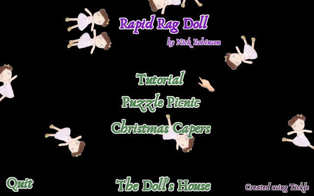
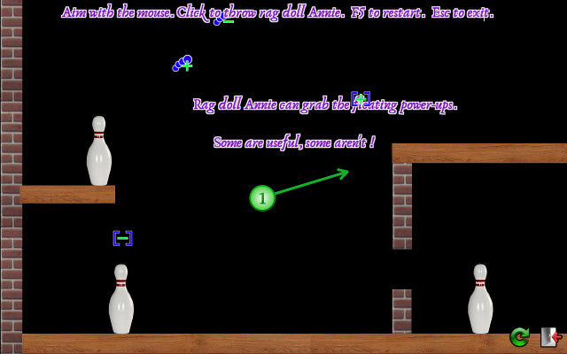
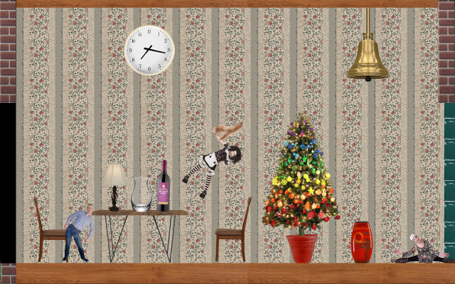

# Rapid Rag Doll

Throw rag dolls to knock over skittles, avoiding breakable objects.

On completing levels, you are rewarded with additional items
in your doll's house.

## Screen Shots

Here's some scaled down screenshots from the game.

However, to get a real feel for the game, you have to see it in action.

I love to watch the doll's fly gracefully through the air (and also, not
so gracefully when the tumble out of control).

It's just so cute, watching the dolls fly by on the menu.

(The text isn't fuzzy in the game!)

Above is the Doll's House. There's nothing to do, but play!
Pick up dolls, rearrange the furniture, or scroll around different parts
of the house (and the garden).

PS, there's a secret key combo.
Pick up a doll (or item of furniture) with the mouse,
and hit plus and minus to make it grow or shrink.
Don't tell anyone ;-)

BTW, the clock does tell the correct time ;-)

## Dolls

The first doll, was Annie, a typical rag doll.
However, at Christmas, I added Santa (and a whole host of Christmas
related items).

Then came the human rag dolls, mostly of friends and family.

My favourite though, is Bony - a skeleton.

## Status

The game has been fully working for a while now. But there's no sound yet :-(

There's a series of "Tutorial" levels, 9 Christmas related levels, plus
a few others. It really needs more levels though.

## Design

Written in Kotlin, using the
[Tickle Game Engine](https://github.com/nickthecoder/tickle).
The physics of the game uses JBox2D (and in fact, the reason for writing the
game was as a demonstation of using JBox2D within Tickle).

I've only tested it on Linux, but it should work with Windows and MacOS
too (fingers crossed).

## Build

You'll need Java 8, or higher, including JavaFX, git and gradle 3 or higher.

First build the tickle game engine (which also requires
[Paratask](https://github.com/nickthecoder/paratask)).

    git clone https://github.com/nickthecoder/paratask.git
    cd paratask
    gradle

    cd ..

    git clone https://github.com/nickthecoder/tickle.git
    cd tickle
    gradle

    cd ..

Now build the game :

    git clone https://github.com/nickthecoder/rapidragdoll.git
    cd tickle
    gradle

You can of course do without git, and download
paratask, tickle and rapidragdoll repositories manually from github.

